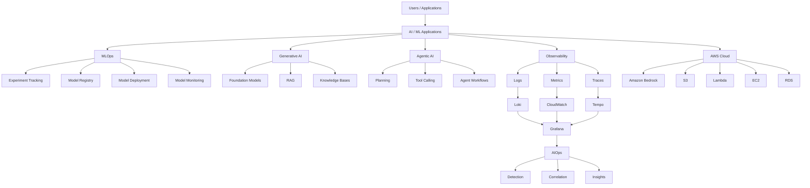
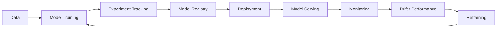
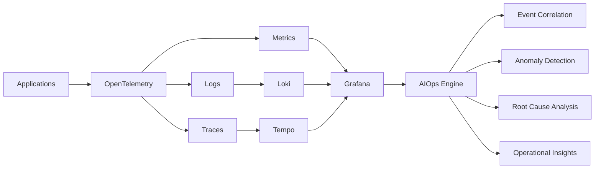
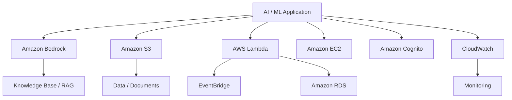
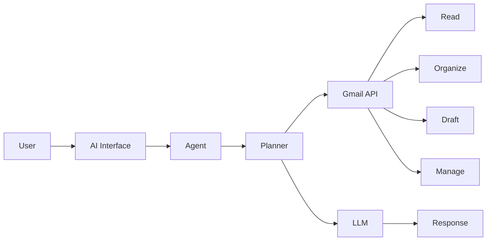
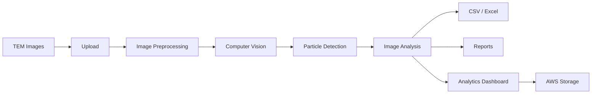
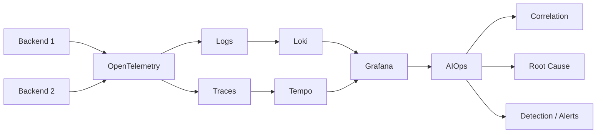

<!-- ============================================================
                    KOGURU VARSHITHA
          AI/ML | AIOps | MLOps | GenAI | AWS
============================================================ -->

<p align="center">
  
</p>

<p align="center">
  <a href="https://www.linkedin.com/in/koguru-varshitha-019140343/">
    
  </a>
  <a href="https://github.com/Varshitha3110">
    
  </a>
</p>

<br>

<p align="center">
  <strong>
    AI/ML Engineer specializing in AIOps, MLOps, Generative AI,
    Observability, DevOps and AWS Cloud Engineering.
  </strong>
</p>

---

# ⚡ Engineering Focus

```text
                         ┌─────────────────────┐
                         │    AI / ML Systems   │
                         └──────────┬──────────┘
                                    │
              ┌─────────────────────┼─────────────────────┐
              │                     │                     │
              ▼                     ▼                     ▼
        ┌───────────┐        ┌────────────┐       ┌──────────────┐
        │   MLOps   │        │  GenAI /   │       │    AIOps     │
        │           │        │   Agents   │       │              │
        └─────┬─────┘        └──────┬─────┘       └──────┬───────┘
              │                     │                     │
              └─────────────────────┼─────────────────────┘
                                    ▼
                         ┌─────────────────────┐
                         │   Cloud / DevOps    │
                         │        AWS          │
                         └─────────────────────┘
```

---

# 🧠 Core Expertise

<p align="center">


</p>

---

# 🏗️ Engineering Architecture



---

# 🛠️ Technology Stack

## Programming

<p align="center">


</p>

<p align="center">
Python · Java · JavaScript · TypeScript · SQL
</p>

---

## AI / ML

<p align="center">


</p>

<p align="center">
Machine Learning · Deep Learning · Computer Vision · NLP · Model Development
</p>

---

## Generative AI & Agents

<p align="center">


</p>

<p align="center">
LLMs · RAG · AI Agents · Knowledge Bases · Amazon Bedrock · LangChain · LangGraph
</p>

---

## MLOps



<p align="center">


</p>

---

# 📡 AIOps & Observability



<p align="center">


</p>

<p align="center">
OpenTelemetry · Grafana · Loki · Tempo · Distributed Tracing · Log Correlation · AIOps
</p>

---

# ☁️ AWS & Cloud Engineering



<p align="center">


</p>

<p align="center">
AWS · Amazon Bedrock · S3 · EC2 · Lambda · RDS · Cognito · EventBridge · CloudWatch
</p>

---

# ⚙️ DevOps & Development

<p align="center">


</p>

<p align="center">
FastAPI · Flask · React · Node.js · Docker · Git · GitHub · Linux
</p>

---

# 🚀 Featured Engineering Projects

## 🎙️ AI Voice Salesbot

```text
User Voice
    │
    ▼
Speech / Voice Interface
    │
    ▼
Amazon Bedrock
    │
    ├──── RAG
    │
    ├──── Knowledge Base
    │
    └──── Conversational AI
    │
    ▼
Enterprise Response
```

**Stack:** Amazon Bedrock · Voice AI · RAG · Knowledge Bases · AWS

---

## ☁️ AWS FinOps AI Agent

```text
AWS Billing Data
       │
       ▼
     AWS
       │
       ▼
   AI Agent
       │
       ├── Cost Analysis
       ├── Usage Analysis
       ├── Optimization
       └── FinOps Insights
       │
       ▼
 Intelligent Recommendations
```

**Stack:** AWS · Amazon Bedrock · AI Agents · FinOps · Cloud Cost Optimization

---

## 📧 Agentic Gmail AI



**Stack:** Python · Gmail API · LangChain · LangGraph · LLMs

---

## 🔬 TEM Image Analysis Dashboard



**Stack:** Python · OpenCV · Computer Vision · Flask · React · AWS

---

## 📊 AIOps Observability Platform



**Stack:** FastAPI · OpenTelemetry · Grafana · Loki · Tempo · Docker

---

## 🚗 AI Vehicle Inspection Pipeline

```text
Vehicle Data
     │
     ▼
Generative AI
     │
     ▼
Vehicle Profile
     │
     ▼
Inspection Workflow
     │
     ├── Trace Propagation
     ├── Evaluation
     └── Observability
     │
     ▼
Production Insights
```

**Stack:** Generative AI · AWS · AI Pipelines · Observability

---

# 🏅 Certifications & Professional Badges

<p align="center">

<a href="https://www.credly.com/badges/7a39f0f4-94b4-437c-8c71-f488c8e51dcf/linked_in_profile"></a>
<a href="https://www.credly.com/badges/ba53a94e-4c8b-40d0-b99f-d1484b7679d9/linked_in_profile"></a>
<a href="https://www.credly.com/badges/b0c7f823-b7ae-4ff7-b865-0963bf27693f"></a>
<a href="https://www.credly.com/badges/47056fe9-c3d7-48d5-a42f-66779eb234c9/linked_in_profile"></a>
<a href="https://www.credly.com/badges/3c5172d4-1f7a-4e6c-93c0-85416c71af93/public_url"></a>
<a href="https://www.credly.com/badges/90bd5b97-3f23-4fda-b3ce-8d0c2978b9c6/linked_in_profile"></a>

</p>

<p align="center">
  <sub>Verified professional learning credentials</sub>
</p>

---

# 📈 GitHub

<p align="center">
  
  
</p>

<p align="center">
  
</p>

---

# 🏆 GitHub Achievements

<p align="center">
  
</p>

---

# 🔗 Connect

<p align="center">
  <a href="https://www.linkedin.com/in/koguru-varshitha-019140343/">
    
  </a>
  <a href="https://github.com/Varshitha3110">
    
  </a>
</p>

---

<p align="center">
  <strong>AI/ML · AIOps · MLOps · Generative AI · Agentic AI · DevOps · AWS</strong>
</p>

<p align="center">
  
</p>
